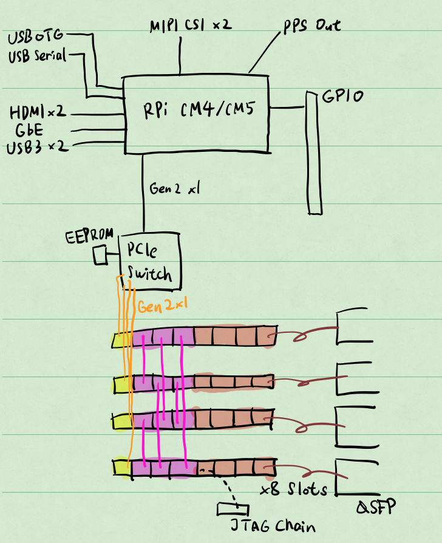
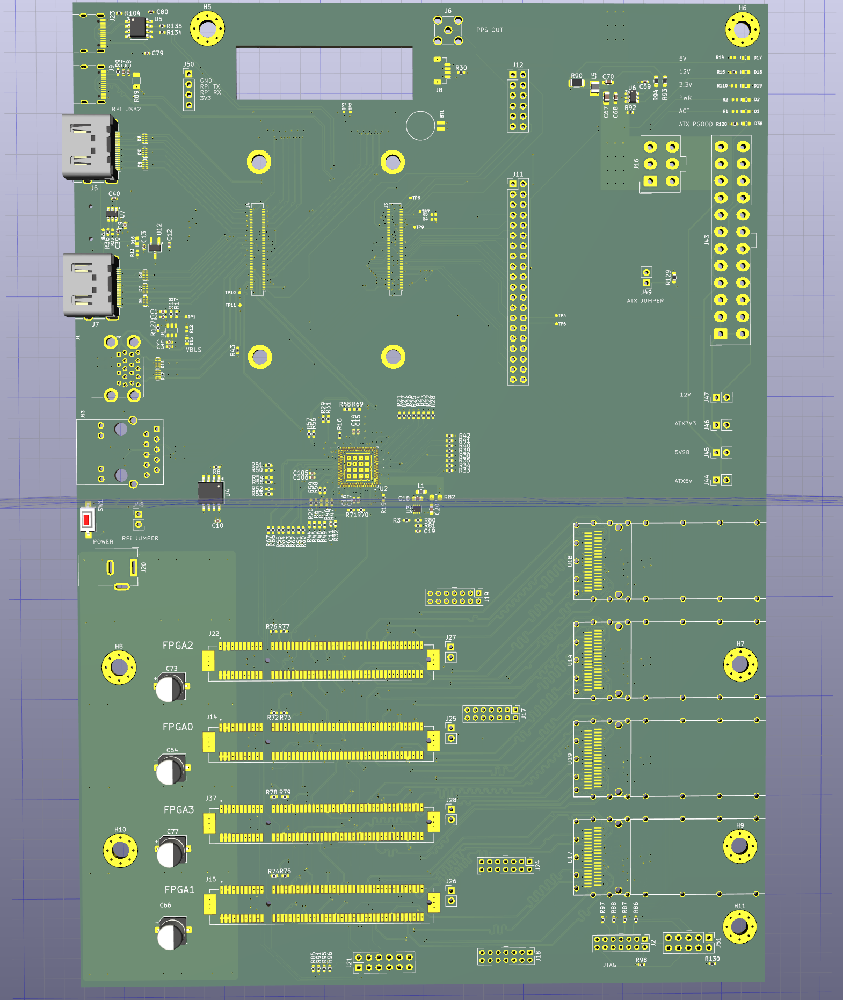
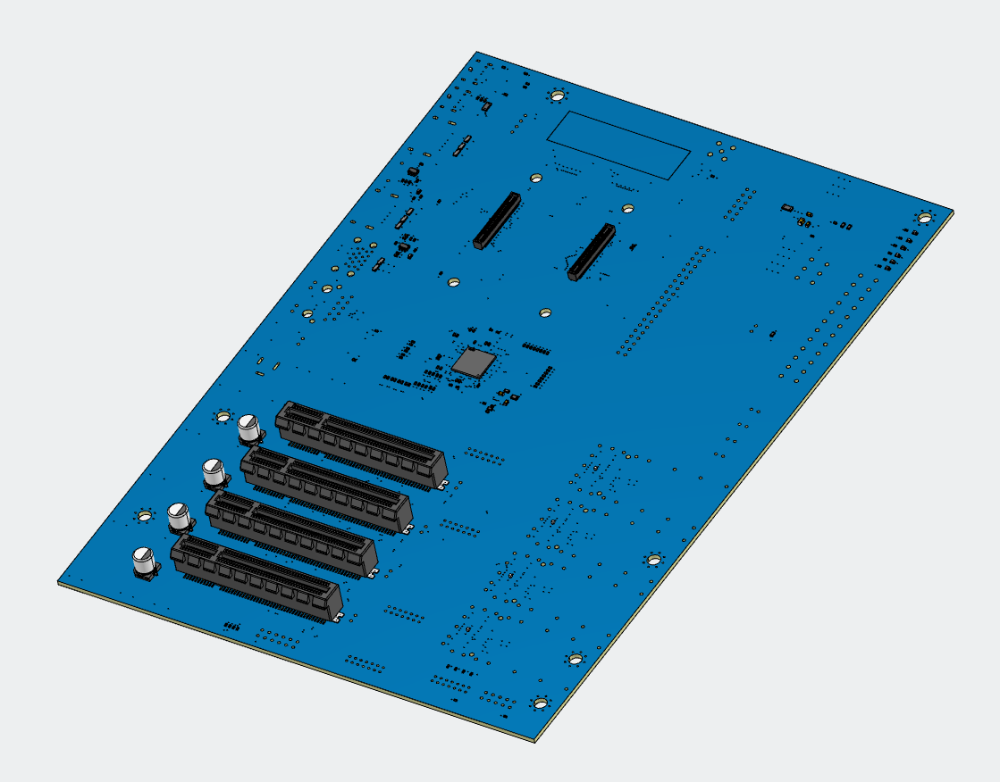

# Tentalab

*Interconnected PCIe FPGA accelerators*

#### Functions

The controller of this board is a RPi CM4/CM5 with PCIe x1. 

A PCIe switch (PI7C9X2G, Gen2 x4 to 4-lane Gen2 X1) bridges the PCIe into 4 PCIe x8 slots, each of them has one lane. 

The PCIe slots are designed for PCIe Kintex 7 accelerators like the [YPCB 480t](https://gist.github.com/regymm/4cfc4f174e3000f97810eb97d52f8ef3), but literally any FPGA cards can be supported. 

Since only 1 lane in the x8 slot are used, another 4 lanes are connected to QSFP connectors for custom protocols, SGMII ethernet, etc. The 3 lanes left are connected to the other 3 boards, forming a mesh connection. 

Designed with remote controlling in thought -- power enable, power switch, UART output, JTAG, and FPGA reset are accessible through pin headers. 

#### Board Preview

#### Manufacture

Designed for standard JLCPCB 4-layer board, impedance is for JLC7628 stacking. 

Now sent for manufacture and waiting for the boards. 

3D preview for SMT: 

#### Funding

This project is funded by the [NLNet Foundation](https://nlnet.nl) [NGI0 Commons Fund](https://nlnet.nl/project/PCIe-DMA-DDR3-accelerator/).
