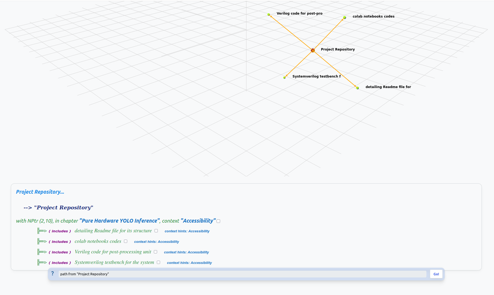
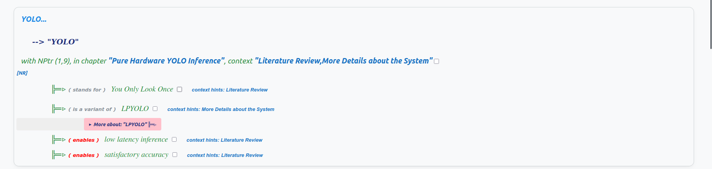
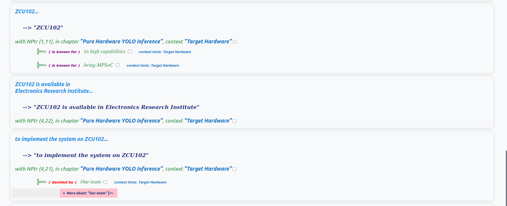
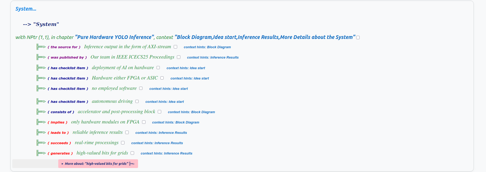
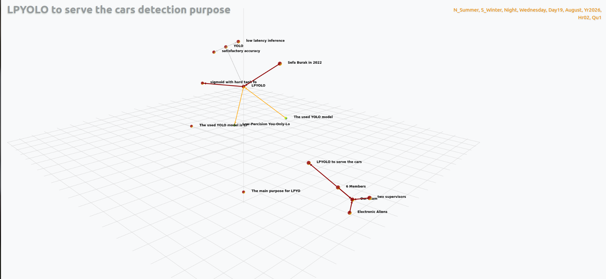
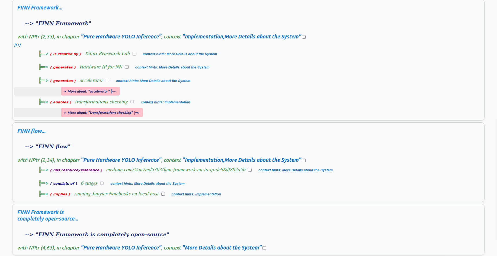
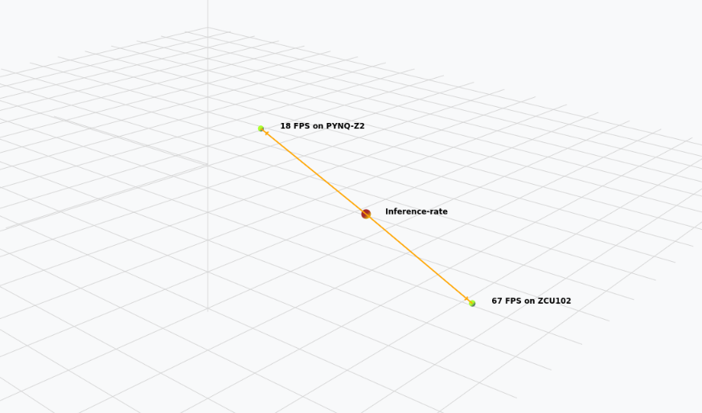

**Disclaimer: The Documentation is AI-generated and may make mistakes**

### Introduction

The project aims to develop a pure hardware system for AI acceleration, specifically for assisting drivers in their cruise. Our team, consisting of six members, named "Electronic Aliens," undertook this project as part of our graduation project in our bachelor's year. We were supported by two supervisors, one from our university and the other from the Electronics Research Institute. The primary goal was to create a system that automates the cruise process without relying on software, thereby enabling more parallelization and hands-on experience with hardware systems.

  
   
  <em>Figure 1: Table of Contents for the original notes viewed on  <a src="https://github.com/markburgess/SSTorytime/blob/main/docs/http_server.md">SSTorytime</a>  knowledge browser</em>

### Accessibility

The project codes are open-source and can be accessed on GitHub at [github.com/m7md5303/pure-hardware-YOLO-inference](github.com/m7md5303/pure-hardware-YOLO-inference). This openness facilitates reproduction and the incorporation of suggestions for improvement. The project repository includes a detailed README file, colab notebooks, Verilog code for the post-processing unit, and a Systemverilog testbench for the system.

  
   
  <em>Figure 2: Contents of the project repository viewed on  <a src="https://github.com/markburgess/SSTorytime/blob/main/docs/http_server.md">SSTorytime</a>  knowledge browser</em>

### License

The project is licensed under the MIT license, which is suitable for open-source projects. This license allows for reusability and redistribution while preserving the authors' rights.

  
   
  <em>Figure 3: MIT License relations viewed on  <a src="https://github.com/markburgess/SSTorytime/blob/main/docs/http_server.md">SSTorytime</a>  knowledge browser</em>

### Literature Review

Before diving into the implementation details, our team conducted a thorough literature review to familiarize ourselves with various algorithms and approaches for similar ideas. We decided to use FPGA as the target platform for our project. Our team explored AI algorithms for autonomous vehicles and chose Convolutional Neural Networks (CNN) for their efficiency in Computer Vision applications. After researching, we found that CNNs provide high accuracy with reasonable latency. However, we needed a more efficient solution for our specific application, leading us to choose the YOLO network. YOLO offers lower latency while maintaining satisfactory accuracy, making it the ideal choice for our system.

  
   
  <em>Figure 4: YOLO specs viewed on  <a src="https://github.com/markburgess/SSTorytime/blob/main/docs/http_server.md">SSTorytime</a>  knowledge browser</em>

### Target Hardware

Our team chose to implement the system on the ZCU102 hardware platform, which has been found to be highly beneficial for hosting our system. The ZCU102 is a versatile platform that supports our project requirements, ensuring efficient AI acceleration for autonomous driving applications.
### Overview of ZCU102 Availability

ZCU102 is available from the Electronics Research Institute (ERI), which has the abbreviation ERI. ERI enables the usage of ZCU102 for our team. ZCU102 is characterized by its high capabilities, high number of resources, and its multi-processor system (MPSoC) architecture, which is abbreviated as Multi-Processor System-on-Chip (MPSoC).

  
   
  <em>Figure 5: Info about ZCU102 viewed on  <a src="https://github.com/markburgess/SSTorytime/blob/main/docs/http_server.md">SSTorytime</a>  knowledge browser</em>

### Target Hardware and Processing System

Our team's target was to use pure hardware, hence the processing system side was not utilized. Consequently, our team decided to use the programmable logic (PL) part of ZCU102. PL stands for Programmable Logic, which is the FPGA side of the System-on-Chip (SoC).

### System Block Diagram

The final system block diagram consists of two pure hardware blocks: the network accelerator and the post-processing block. The system has an input interface of AXI-stream and an output interface of AXI-stream. The system does not involve any software-dependent functions, making it purely hardware-based.

  
   
  <em>Figure 6: System overview viewed on  <a src="https://github.com/markburgess/SSTorytime/blob/main/docs/http_server.md">SSTorytime</a>  knowledge browser</em>

### Input and Output Interfaces

The input image is packed in AXI-Stream frames, representing the road image from the driver's perspective. The AXI-Stream data is efficient for streaming applications due to its low control overhead and is used by most Xilinx IPs. Therefore, our team decided to use AXI-Stream as the input and output interfaces for the system.

  
   
  <em>Figure 7: AXI-Stream overview viewed on  <a src="https://github.com/markburgess/SSTorytime/blob/main/docs/http_server.md">SSTorytime</a>  knowledge browser</em>

### Inference Output

The inference output consists of 13 signals called row_det signals, accompanied by a detect_valid bit. Each row_det signal represents a 13 x 13 matrix, with each bit corresponding to 32 x 32 pixels in the original image. The detect_valid signal ensures that only valid predictions are communicated to the receiving block, enabling faster and safer responses.

### More Details about the System

The accelerator in the system is for the neural network, while the post-processing block processes the raw output of the neural network to obtain the final inference results. The used YOLO model is LPYOLO, which is a variant of YOLOv3 with a hard tanh function for hardware compatibility. LPYOLO was proposed by Sefa Burak in 2022 and was retrained for car detection.

### Neural Network and YOLO Model

The neural network used in the system is called LPYOLO, which is a Low-Precision You-Only-Look-Once model. This model replaces the sigmoid function with hard tanh for hardware compatibility. The system's main purpose is object detection, specifically for car detection.

  
   
  <em>Figure 8: LPYOLO overview viewed on  <a src="https://github.com/markburgess/SSTorytime/blob/main/docs/http_server.md">SSTorytime</a>  knowledge browser</em>

### System Overview

The system was primarily designed for face detection. Our team trained the LPYOLO model to serve the purpose of car detection. The dataset used was published by a user on Kaggle. The use of Sigmoid replacement makes the system more hardware-friendly. The accelerator, a transformed neural network, is followed by the post-processing block. The accelerator supplies the post-processing block with raw detection bytes from the NN core computations. The accelerator is generated by the FINN Framework, which creates hardware IP for neural networks. The FINN Framework is developed by Xilinx Research Lab and is completely open-source. The FINN flow consists of six stages, as detailed in the reference  <a src="https://medium.com/@m7md5303/finn-framework-nn-to-ip-dc88df882a5b">provided</a>  . 

### Post-Processing Module

The post-processing module, named yolo_post, is implemented using Verilog. Verilog enables efficient resource control and supports higher throughput. The raw detection bytes from the accelerator are processed by the yolo_post module. Each of the three anchor boxes generates 6 bytes, with the last two bytes representing the probability of class and objectness scores. These scores are represented by two bytes each for each anchor box. The class and objectness scores are multiplied together to determine the presence of cars. The multiplication implies no floating-point operations. The system considers three anchor boxes for safety purposes, ensuring that the presence of a car is confirmed even if only one anchor box detects it.

  
   
  <em>Figure 9: post-processing module overview viewed on  <a src="https://github.com/markburgess/SSTorytime/blob/main/docs/http_server.md">SSTorytime</a>  knowledge browser</em>

### Detailed Implementation

The system's implementation was carried out using Jupyter Notebooks for most of the flow. Colab Cloud was used for training and exporting the model, provisioned by Google. After training, the QONNX file, representing the quantized neural network, was derived from the trained model. The QONNX file was delivered to FINN for transformations, which involved eliminating floating-point operations and converting NN layers to hardware conversions. FINN Framework enabled these transformations and checking, with transformations checking preceding IP generation. The parallelism degree of the accelerator was determined by the designer, and the clock frequency was set to 150 MHz, sufficient for real-time calculations. The FINN flow involves running Jupyter Notebooks on a local host. The post-processing is handled by the yolo_post module, which involves no floating-point operations and uses Verilog functions for code tidying.

 
<em>Figure 10: FINN overview viewed on  <a src="https://github.com/markburgess/SSTorytime/blob/main/docs/http_server.md">SSTorytime</a>  knowledge browser</em>

### Inference Results

The final results were visualized using PYNQ Jupyter Notebook, implementing the accelerator on the PYNQ-Z2 alongside the main board, ZCU102. Testing on the PYNQ-Z2 utilized Xilinx AXI DMA for sending test images. The clock frequency on the PYNQ-Z2 was set to 100 MHz, resulting in high-valued bits for grids containing cars. The system generated reliable inference results, and the system was published in the IEEE ICECS25 Proceedings by our team.
### System Performance in Real-Time Processing

The system demonstrates exceptional performance in real-time processing, achieving a frame per second (FPS) rate of 67 on the Zynq UltraScale+ MPSoC (ZCU102) and 18 FPS on the Pynq-Z2. These results highlight the system's capability to handle high computational demands efficiently.

### Inference Rate on Different Platforms

- **Zynq UltraScale+ MPSoC (ZCU102)**: The system achieves an inference rate of 67 FPS, indicating its robustness and efficiency in processing tasks in real-time.
- **Pynq-Z2**: On the other hand, the system operates at a lower rate of 18 FPS, which is still significant for real-time applications and demonstrates the system's versatility across different hardware platforms.

 
<em>Figure 11: FPS results viewed on  <a src="https://github.com/markburgess/SSTorytime/blob/main/docs/http_server.md">SSTorytime</a>  knowledge browser</em>

### Application Capabilities

The system's performance has been validated in applications that require real-time processing, particularly in the domain of autonomous vehicles. This capability underscores the system's potential in handling the complex and time-sensitive tasks required for autonomous driving systems.
