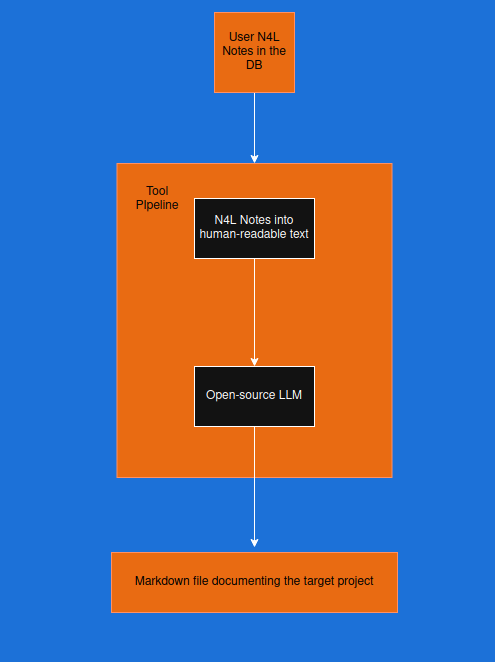

<h1 style="color: #1a4b6e; border-bottom: 3px solid #2c7da0; padding-bottom: 8px;">Auto_N4L_2_Documentation</h1>

<strong>Project Author:</strong> <a href="https://github.com/m7md5303" style="color: #2c7da0; text-decoration: none;"> Mohamed Khaled</a>

  <strong>Disclaimer:</strong> This document assumes you are using Jan 2026 version of the <a href="https://github.com/markburgess/SSTorytime/tree/main" style="color: #2c7da0;">SSTorytime Project</a> and that you are familiar with writing N4L notes and uploading them to the knowledge database.

<h3 style="color: #1c4e6c; font-size: 1.5rem; margin-top: 30px;">0. Document Overview</h3>

<ul style="display: grid; grid-template-columns: repeat(2, 1fr); gap: 8px; margin: 15px 0 25px 0;">
  <li style="background: #eef2f7; padding: 6px 12px; border-radius: 20px;">1- objective</li>
  <li style="background: #eef2f7; padding: 6px 12px; border-radius: 20px;">2- Tool Accesibility</li>
  <li style="background: #eef2f7; padding: 6px 12px; border-radius: 20px;">3- System Architecture</li>
  <li style="background: #eef2f7; padding: 6px 12px; border-radius: 20px;">4- Getting the final output</li>
  <li style="background: #eef2f7; padding: 6px 12px; border-radius: 20px;">5- Security</li>
  <li style="background: #eef2f7; padding: 6px 12px; border-radius: 20px;">6- Best Practice Usage</li>
  <li style="background: #eef2f7; padding: 6px 12px; border-radius: 20px;">7- How to run the software ?</li>
  <li style="background: #eef2f7; padding: 6px 12px; border-radius: 20px;">8- Funding</li>
  <li style="background: #eef2f7; padding: 6px 12px; border-radius: 20px;">9- License</li>
  <li style="background: #eef2f7; padding: 6px 12px; border-radius: 20px;">10- Author</li>
</ul>

<h3 style="color: #1c4e6c; font-size: 1.5rem; margin-top: 30px;">1. Objective</h3>

Welcome to the Auto_N4L_2_Documentation repository. This project aims to create an automated flow for generating projects documentation directly from the user N4L Notes stored in the database without the need for human involvement in any of the steps. That said, this technique would allow automating generation of documentation of projects without spending hours or days in trying to figure out what the best way is to describe your project.

The flow of the tool is based on running a python script that parses the knowledge database containing the user N4L notes and autonomously generating the output documentation. That means that your <strong style="color: #1a4b6e;">N4L notes = Documentation for your project</strong>

<h3 style="color: #1c4e6c;">2. Tool Accesibility</h3>

As shown in the next figure, the conversion tool is fully open-source without employing proprietary blocks. This should allow anyone to make use of the tool without worrying about obtaining costly licenses for having the tool service. Starting from the imported python libraries used in the tool and even the employed LLM, all of them are open-source.

<h3 style="color: #1c4e6c;">3. System Architecture</h3>

The system architecture consists of two main blocks:

<ul style="margin: 10px 0 20px 25px;">
  <li style="margin: 8px 0;">Python libraries for N4L Notes static parsing</li>
  <li style="margin: 8px 0;">LLM for generating the desired documentation</li>
</ul>

Nevertheless, it is necessary to have the chapter you want to document uploaded to your knowledge database. This is mandatory for the tool to have a proper run otherwise, you will sadly get a printed error in your terminal.

As was mentioned in the introduction, the process is fully autonomous. Hence, what you have to do is to provide N4L notes for your project and give them to the tool through just uploading them to the database (which is what you are already doing as a typical user of the <strong>SSTorytime project</strong>)

The tool is then responsible for retrieving your N4L notes and converting them into human-readable tools. This the tool responsibility you aren't asked to do anything.

This conversion is through translating the arrows into their real meaning. That said, it is expected that the configuration files you have containing your arrows are having proper written arrows definitions.

This retrieved text is chunked into 120 lines per chunk (at most) and provided to the LLM. This chunking process is for making sure everyone would be able to use the tool regardless how long his notes are. So that, if your notes are too long, you won't be worry of breaking the input tokens limit of the model.

<h5 style="color: #2c6280; font-size: 1.1rem; background: #eef2f7; display: inline-block; padding: 4px 16px; border-radius: 30px;">What happens next?</h5>

Through a well-designed system prompt, the LLM is able to generate the final documentation. This happens through the providing these 120-line chunks to the model as batches and it generate the markdown file directly from these lines.

<h4 style="color: #235b7a;">3.1. Choosing Python Libraries</h4>

The imported python libraries with the justification are as follows:

<ul>
  <li><code style="background: #eef2f7; padding: 2px 8px; border-radius: 8px;">re</code> : for parsing the N4L notes for getting the metadata of the retrieved lines from the database</li>
  <li><code style="background: #eef2f7; padding: 2px 8px; border-radius: 8px;">sys</code> : for catching the chapter name the used provides in the tool running command through the terminal</li>
  <li><code style="background: #eef2f7; padding: 2px 8px; border-radius: 8px;">process</code> : for running the SearchN4L method in the backend without making the user worry about any intermediate steps</li>
  <li><code style="background: #eef2f7; padding: 2px 8px; border-radius: 8px;">llamacpp</code> : for accessing the LLM model and calling it with the pre-built prompt</li>
</ul>

<h4 style="color: #235b7a;">3.2. Choosing the Large Language Model</h4>

Choosing the LLM was one of the vital decisions to be taken for this system due to the famous tradeoff between the model size and the accuracy.

The issue is if you want very high accuracy you would accordingly choose a big model, which will definitely add bad user experience to the tool

Choosing a small model would consequently lead to very bad output making the tool totally useless

Hence, the used model to be employed in this system has to be satisfying the desired accuracy and with speed performance appropriate for typical PC users.

Thus, the chosen model is <code style="background: #1e2a32; color: #eef4fc; padding: 2px 8px; border-radius: 8px;">Qwen/Qwen2.5-3B-Instruct-GGUF</code> for:

<ul>
  <li>✅ Intermediate size suitable for most of users</li>
  <li>✅ Quantized model so that it doesn't require much space in memory</li>
  <li>✅ Not very small leading to satisfying output</li>
  <li>✅ The most important thing is that it is open-source so that anyone can use it without need for costly licenses</li>
</ul>

The pipeline flow can be summarized as follows:

<ul>
  <li><strong style="color: #1a4b6e;">N4L Notes uploaded to the database</strong>: This is a crucial requirement for the tool to work properly as the software expects the target chapter is already uploaded to the database. In case you were targetting an N4L chapter that doesn't exist in the database, the code will simply exit due to the retrieval error.</li>
  <li><strong style="color: #1a4b6e;">Notes Retrieval</strong>: Given that the n4L notes were properly uploaded to the database, the software here statically converts all the notes under the target chapter into human readable text. This function is built on the top of the SearchN4L API provided in the SSTorytime project.</li>
  <li><strong style="color: #1a4b6e;">LLM Role</strong>: In this stage, the retrieved text is chunked into 120 lines/chunk and introduced to an open source quantized LLM: <code>Qwen/Qwen2.5-3B-Instruct-GGUF</code>. The model is responsible for generating the final markdown file that represents the project documentation</li>
</ul>

<h3 style="color: #1c4e6c;">4. Getting the final output</h3>

Now, after you have gone through the full process, you would be excited to see how your documentation looks like. <strong style="background: #eef2f7; padding: 2px 8px; border-radius: 8px;">The output should appear in <code>SSTorytime/generated_md/</code> with file name: your_chapter_name.md</strong> . That said, your documentation doesn't lie far from your hands as some tools do, this tool generate the documentation under the same root where the <code>SSTorytime Project</code> is installed in your device.

Moreover, additional feature is provided to users who don't love AI. In the same path: <code>SSTorytime/generated_md/</code>, you can find a file called <code>tmp.md</code> This file contains all your N4L notes in human readable text i.e. with replacing N4L notes with their meaning. This should allow you to inspect your notes how they look like in human-readable text and also to evaluate the generated markdown from the LLM

<h3 style="color: #1c4e6c;">5. Security</h3>

  
Using LLMs may sound creepy for some engineers who worry about the privacy of their codes or may be working on confidential projects. In this project, we aren't using clouds of any type. Thus, the LLM is run <strong>locally on your own PC</strong> leaving no space for anyone to spy on your project or your personal notes.

  
Will your PC bear running the LLM?? As you will see in future section of this guide, we are using a quantized LLM making it affordable by typical PCs with no worries about running out of RAM.

  
Additionally, the tool usage doesn't require any internet connection from any type making it available for the user whether he is connected to internet or not

<h3 style="color: #1c4e6c;">6. Best Practice Usage</h3>

An important question shall arise: Do you have to focus on some technique in using the tool to get better output? The answer is yes and no!

It is no because you don't have to do anything to the tool as the flow is fully automated.

However, you should know that your N4L Notes are provided to an LLM who doesn't know anything about your project. SO for getting a satisfactory output, you should be careful while writing your N4L notes in a good way to be understandable by the model (Which I assume you are already doing)

<h3 style="color: #1c4e6c;">7. How to run the software ?</h3>

Now, you should be asking: how can I use this magical tool? Congratulations, you have reached the answer. This section discusses how you can run the tool after cloning the project.

The relative paths and internal commands are assuming this repo files are under the hierarchy <code>SSTorytime/src/md_generator.py</code> and <code>SSTorytime/src/md_requirements.sh</code>

<h4 style="color: #235b7a;">7.1. Requirements</h4>

Firstly, some required libraries and the model itself are required to be installed. For overcoming this issue, you can easily find an installation script for all the requirements which you can run easily as:

<pre style="background: #1e2a32; color: #eef4fc; padding: 16px; border-radius: 16px; overflow-x: auto;">
<code style="background: transparent; color: #eef4fc;">./md_requirements.sh</code>
</pre>

<h4 style="color: #235b7a;">7.2. Running the tool</h4>

Once the installation is complete, you can now use the tool for generating your documentations automatically through:

<pre style="background: #1e2a32; color: #eef4fc; padding: 16px; border-radius: 16px;">
<code style="background: transparent; color: #eef4fc;">python3 md_generator.py &lt;your_chapter_name&gt;</code>
</pre>

You may run the python script differently in case of using different OS from Ubuntu 22.04., just be sure you have written the correct chapter name

<strong>Example Output</strong>: <a href="https://github.com/regymm/PCIe-DMA-DDR3-Accelerator/blob/main/10-documentation/AIN4L%20Documentation/Pure_Hardware_YOLO_Inference.md" style="color: #2c7da0;">Here</a> It is generated from this <a href="https://github.com/regymm/PCIe-DMA-DDR3-Accelerator/blob/main/10-documentation/AIN4L%20Documentation/eayolo.n4l" style="color: #2c7da0;">notes file</a>

<h3 style="color: #1c4e6c;">8. Funding</h3>

The project is funded by <strong style="color: #1a4b6e;">NLnet</strong>

<h3 style="color: #1c4e6c;">9. License</h3>

The project is under <strong>GPL License V2.0</strong>

<h3 style="color: #1c4e6c;">10. Author</h3>

This document and the software tool is authored by <a href="https://github.com/m7md5303" style="color: #2c7da0;"> Mohamed Khaled</a> from <strong>Symbiotic EDA</strong>

