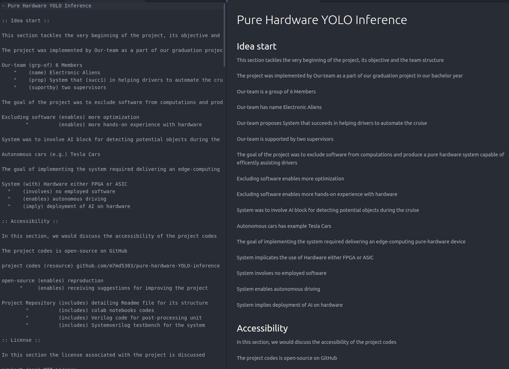

# N4L to Documentation (N4L2Doc)
This article is to provide a complete guide for converting N4L-written documentation into markdown documentation. If you aren't familiar with how projects can be written with N4L or you aren't familiar with what N4L is, please visit <a href="https://github.com/regymm/PCIe-DMA-DDR3-Accelerator/blob/main/10-documentation/N4L%20for%20Documentation/n4l4doc.md">this article</a>

<p><strong>Document Author:</strong> <a href="https://github.com/m7md5303" style="color: #2c7da0; text-decoration: none;"> Mohamed Khaled</a></p>

## 0.Document Agenda
1- Motivation

2- The Conversion Process

3-Real Case Example

4-Enhancing the output

5-Automating the process

6-Funding

7-License

8-Author
## 1.Motivation
This document discusses how a project documentation written in N4L can be converted into human readable text in markdown format. Sometimes, it may be required explicitly that the project documentation should be delivered in markdown format. Also, the manager can request from the employees to provide a markdown documentation for the implemented project with no special-format documentation as in N4L.

Thus, this article is to help you to convert your N4L documentation into human readable markdown file. That said, this process is pretty simple where it is just the reverse of what you have done when you documented the project in N4L.

The final output that you should get after following this article instructions, is a project documentation in markdown format out of your original documentation in N4L.

## 2.The Conversion Process

This is the core section of the document, where here, the very steps of converting an N4L documentation for a certain project into markdown format. For that to be done, one has to follow some steps.

#### 1) Extracting the Title
In this step, we have to retrieve the title from the written N4L. This is important to know what is the main topic of the documented project. As in the N4L4Doc article, project titles in N4L are represented as the chapter title with a dash-preceded line:
```N4L
- Project Title
```
Consequently, to convert titles in N4L to markdown, one would give it the style of header 1 through:
```Markdown
# Project Title
```
This would appear in your file in the following format:
# Project Title


This is the first step in the conversion process. Now, you have the header for the new documentation file which is the project title itself

---------------------------------------------------------------------
### 2) Retrieving Sections

Next, you have to retrieve the sections taking place at your N4L file. The sections may represent a separate topic in your project or discussing a certain IP/function in the project. Thus, whenever you find an N4L section title, it should be mapped into a sub-header in the corresponding markdown file.
As shown earlier, sections in N4L are represented like:
```N4L
:: section header ::
```
For this to be converted to markdown format, it is trivial to deduce that it shall be converted into header 2 or 3 style through:
```Markdown
## section header
```
and this would end up in the following style:
## section header
This step is to be done to all sections in the N4L file. Hence, you should now have the Project title as `header 1` and the sub sections in this file as `header 2 (3)`

---------------------------------------------------------------------
### 3) Interpreting Arrows

Now, the left step is to extract the notes themselves from the N4L file. The notes either represent relations between two nodes thus, having an N4L arrow between them or having normal English text.

For the normal English text, you just put it as it is in your new markdown file.

For the N4L lines containing arrows, you should have known that relations between objects/events are represented with relations (arrows) in N4L. Now the question is how to convert this N4L notes into readable markdown text. As was discussed in N4L4Doc, N4L arrows are categorized into four types. For the conversion process you would have to:
 - Recognize which category this very arrow belongs to.
 - You shall visit the config file (.sst) of this category searching for your arrow.
 - After you find it, you will see it besides its meaning in the same line.
 - Replace the arrow `e.g. (different!)` with its translation ` is nothing like `.
 - Write the English line after replacement under the corresponding section context

```markdown
It may be important to mention that writing plain text in markdown format doesn't need any special formatting.
```

-------------------------------------------------------------------

### 4) Lists

**What about dattos?**

It was mentioned in N4L4Doc that N4L supports using `"` instead of rewriting the same source node that may come consecutively in more than one line. This is one of the advantages of writing with N4L.

A demonstration can be provided as:
```N4L
object1 (relation1) object 2
    "   (relation2) object 3
```
For converting such lines, you can simply replace the datto with the last appearing source node in the previous line
This can be interpreted as:
```Text
object1 (relation1) object 2
object1 (relation2) object 3
```
However, markdown format provides beautiful listing for cases like this, so you can just type object 1 once and list its relations beneath it
```Markdown
object 1
- similar to object 2
- different from object 3
```
This would appear in your file as:

object 1
- similar to object 2
- different from object 3

------------------------------------------------------------------------
## 3.Real Case Example
Revisiting the example provided in the N4L4Doc article `eayolo.n4l`, it would be useful to demonstrate through it how can N4L documentation to be converted into readable markdown text.

Well, if you followed the past guide, you wouldn't struggle at all. You may prefer to add some markdown decorations such as adding some **bold text** or *italic one*



This snippet provides an example for the simple way of conversion discussed in the previous section. The full N4L file is found <a href="https://github.com/regymm/PCIe-DMA-DDR3-Accelerator/blob/main/10-documentation/AIN4L%20Documentation/eayolo.n4l">here</a> and its conversion is <a href="https://github.com/regymm/PCIe-DMA-DDR3-Accelerator/blob/main/10-documentation/N4L%20for%20Documentation/tmp.md">here</a>

## 4.Enhancing the output

You may notice that the generated markdown file is relying on sparse lines with no paragraphs like documentations have conventionally. So for improving such a file, you would take this intermediate file and deal with its sections separately. In other words, you can read the plain text lines under each section and convert them into paragraphs suitable for your requirements. Nonetheless, this process should be easy as it can be considered as if you are just paraphrasing without the need to completely create a documentation from scratch.

## 5. Automating the process

In case you feel this process can sound tedious, you can visit <a href="https://github.com/regymm/PCIe-DMA-DDR3-Accelerator/tree/main/10-documentation/AIN4L%20Documentation">this project</a> for an AI-assisted tool for automatically converting the N4L file stored in the database directly into a project documentation in markdown format.

<h2 ">6. Funding</h2>

<p>The project is funded by <strong ">NLnet</strong></p>


<h2 ">7. License</h2>

<p>The project is under <strong>GPL License V2.0</strong></p>

<h2 ">8. Author</h2>

<p>This document and the methodology is authored by <a href="https://github.com/m7md5303""> Mohamed Khaled</a> from <strong>Symbiotic EDA</strong></p>


