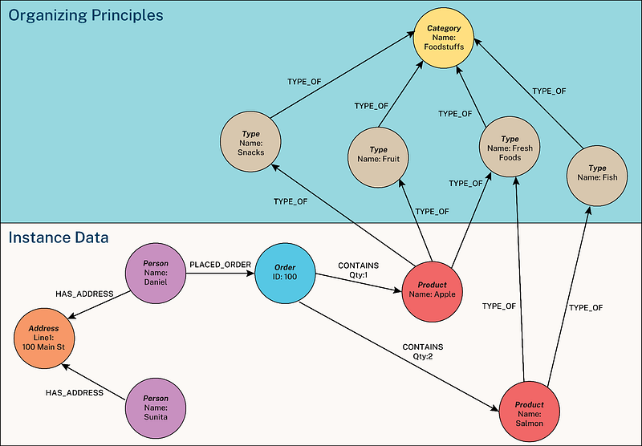
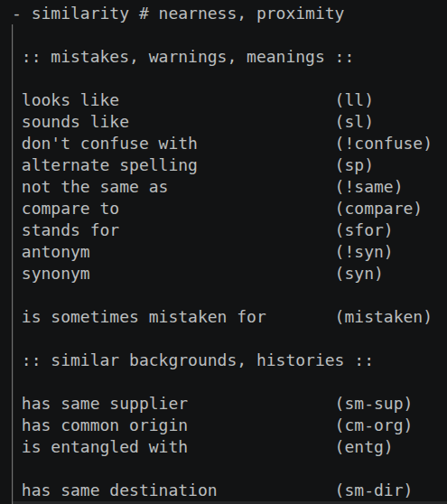
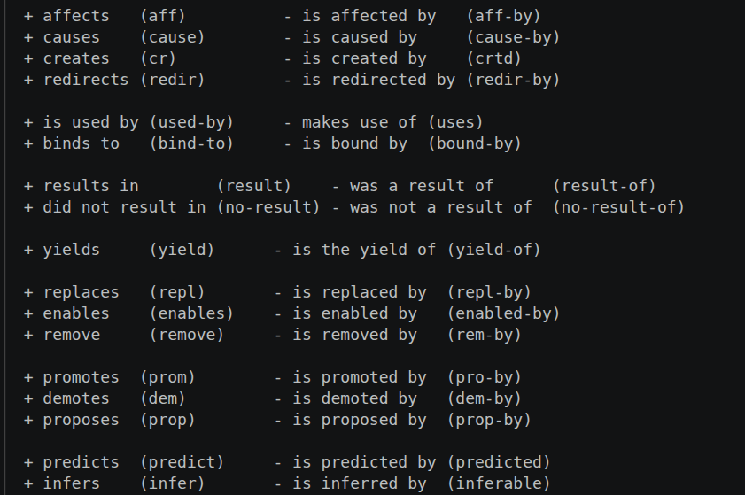
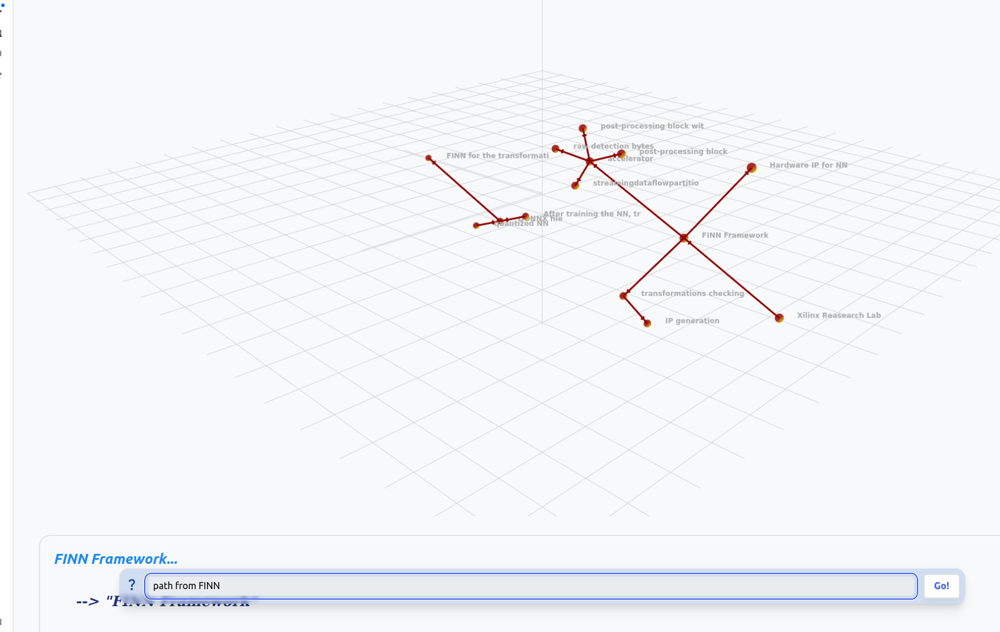
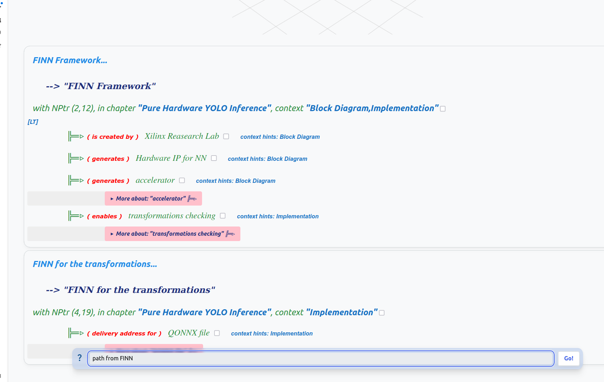
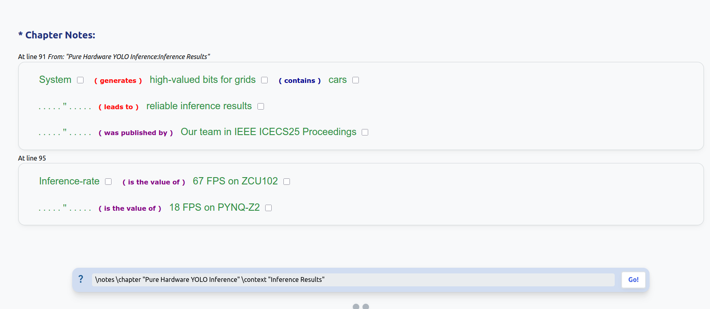
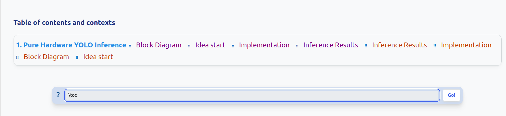

# N4L for Documentation (N4L4Doc)
This article discusses a new technology for documenting projects, preserving and sharing knowledge. It is the first step toward transforming how engineers deal with knowledge and how experience can be more portable and shareable.

<p><strong>Author:</strong> <a href="https://github.com/m7md5303" style="color: #2c7da0; text-decoration: none;"> Mohamed Khaled</a></p>

<strong>Disclaimer:</strong> This document assumes you are using the Jan 2026 version of the <a href="https://github.com/markburgess/SSTorytime/tree/main" style="color: #2c7da0;">SSTorytime Project</a>
## 0. List of Contents
1- Objective

2- What is N4L?

3- Diving into N4L syntax

4- Documenting Hardware/Software Projects Using N4L

5- Visualizing the Knowledge Graph

6- Conclusion

7- Funding

8- License

9- Author

## 1. Objective
This document aims to provide a guide for hardware and software engineers and students on how to use the Notes for Learning (N4L) technology to establish an efficient methodology for documenting projects. The main goal is to change the way engineers and students think about how project components are related in order to create a well-organized graph representing these components. This should contribute to simplifying the documentation process without the need to write hundreds of pages of documentation.

The document will also guide you on how to use the `SSTorytime` technology to visualize and explore connections between your project components. Additionally, the document will discuss how to make use of the proposed methodology to share knowledge with colleagues and to help users revisit knowledge they might have forgotten or need reasoning for it.

Hereinafter, we will refer to our proposed methodology as `N4L4Doc`, which stands for `N4L for Documentation`.

## 2. What is N4L?
In this section, we will provide a brief introduction to what N4L is and what it aims for. N4L stands for **Notes for Learning**. It is a special note-taking format that was proposed in the **SSTorytime** project mentioned earlier.

Its goal is to build a technology that transforms our knowledge into an organized form that facilitates knowledge reasoning. This form is called **Knowledge Graph**. Before we continue discussing N4L and what it can be used for, we shall provide a brief introduction to **Knowledge Graphs**.

### What are Knowledge Graphs?

Most engineers are familiar with CSV and xlsx sheets where data are stored in a tabular form. Maybe columns represent the type of utilized resources in an FPGA project (e.g. LUTs, BRAMs) or even latency and power. Whether you have noticed or not, these tables represent a form of database. Other forms of storing data include binary databases and JSON-formatted databases. *You don't have to be familiar with all of that.*

The question now is, what are Knowledge Graphs?

Knowledge graphs are a way of storing data in nodes and arrows. You can initially imagine it as a tree which has branches and leaves. The nodes in a certain graph represent objects in your database while the arrows represent the relations between these objects.

**What can we gain from such a setting?**

Reasoning...

AI experts know well that tree-like organization of data provides a clear explanation for how data is related to each other. Moreover, nodes whose category (parent node) is known become more searchable in that setting.

Now look at the following figure. What if you were provided a tool that can handle your project mess by creating a well-organized graph that gives reasoning for how your project flows. Would that be a great thing, wouldn't it?



As the graph shows, objects (nodes) are placed inside circles. These circles are related to each other in some way. The relations between them are expressed as arrows. For instance, the node `Apple` has a relation of `Type-of` with the node `Fruit`.

Nevertheless, creating such a graph manually would require you to draw many circles and to connect many arrows. This is a tiring process, isn't it? Moreover, what if you connected the wrong nodes unintentionally, or defined the wrong relation between two nodes? This would lead to the corruption of the database...

### Back to N4L

Now, after you have become more familiar with what knowledge graphs are, their pros and their potential problems, we can discuss how N4L can help to get the most out of these graphs and to overcome these potential problems. As mentioned before, N4L is a special note-taking format. Hence, it is not a programming language and you don't have to learn complex for loops or nested if else statements. 

The role of N4L is to transform your own notes automatically into organized knowledge graphs. This facilitates the storage of your knowledge and helps reasoning it upon revisiting. As we will learn, you will be able to search for whatever object you want to study or what relations exist between it and other objects there.

We can conclude the flow in one sentence: **Your notes = Your Knowledge Graph**

Nonetheless, we have said that N4L is a special note-taking format, what can be special about it? Why can it be better than traditional methods? And how can it be used in documentation?

### Why do we write notes?

Taking notes has always been the way to save important knowledge you want to revisit later. Note-taking methods vary from one person to another. One may choose traditional ways like pencil and paper. Others may prefer to use digital notes or digital handwriting. All of them aim for one thing...storing important information for revisiting.

Although these methods are widely used, they do suffer from many drawbacks. The most common problem with these methods is that after a long time of leaving your notes unvisited, you can hardly remember the reason why you wrote them. You just find unorganized lines about a certain topic but they have become useless. You can neither understand them nor know how they are related to each other...just plain text.

Additionally, you will realize you can't share your notes. This is because of one of two reasons. The first one is that your notes hold mysterious keywords that only you can understand. Hence, others will not understand them. The second reason is that if you couldn't interpret your **own** notes, others wouldn't.

To sum up, we write notes to save information we can revisit later although they lack interpretability and sustainability.

### N4L Vs. Literature

To overcome vulnerabilities of other methodologies, N4L provides:

**Interpretability** : No matter how complicated the relation between two objects is, you can always find them connected by the suitable arrow making it easy for you to understand how objects are related which was hard to find out through traditional ways.

**Sustainability**: No matter how long you leave your notes unvisited, whenever you come back to them, you will find reasoning behind your notes and how objects within are related

**Portability**: Through traditional note-taking, maybe not all of your friends/colleagues can understand your scribbles, but with N4L, they will not struggle to find out how objects in your notes are related, making it easy for everyone to interpret the idea of your notes.

**Cost**: Note-taking with N4L helps in cutting down expenses related to having costly licenses for accessing the database that you create or buying paper and pencils for writing down what you are documenting

**Auto-organized**: You neither have to create tables for organizing your notes nor create a specific file for each topic. As we have mentioned, N4L notes are transformed automatically into a knowledge graph through its built-in compiler found in the ``SSTorytime Project``. Hence, you only need a text-editor installed on your PC for writing your N4L text.

**Editability**: Unlike some methods where it is hard to add modifications or build upon something existing, N4L allows adding whatever modifications you need whenever needed.

**No erosion**: Using N4L saves knowledge from being lost unlike old papers that you may lose or forget where you stored at your office.

## 3. Diving into N4L syntax

At this step, you should be aware of:
- Goal of the document
- Knowledge graphs concept
- Traditional noting flaws
- Pros of N4L over literature

However, these were only abstract and theoretical concepts that we can't properly judge whether we are really dealing with a useful technology. Now, this is the time to reveal the technical details about the proposed methodology and to discuss the effectiveness of replacing traditional methodologies.

### SSTorytime Project

As mentioned earlier, N4L itself is not a separate project but it was created by the authors of `SSTorytime project`. Thus, to make the most of the method, you are encouraged to firstly install the original project. As was noted before, it is assumed you are using the **Jan 2026** version of this project.

The good news is that the SSTorytime project is open-source and the source code are accessible on GitHub.

### Installing the project

As with most open-source projects on github, what you need is to clone the source code to the machine you intend to use the method on. The project can be accessed from <a href="https://github.com/markburgess/SSTorytime/tree/main">here</a>. But don't forget to clone the **Jan 2026** version...why?

`Using N4L4doc does not depend on the version of SSTorytime being used. However, the relative paths and commands used in this document would differ a little bit from those used in the future versions of the project. `

Under the root directory of the cloned project, at `./docs/GettingStarted.md`, you can find a complete guide on how to make the environment ready to use the project properly.

### Hello World

After you have properly installed the project, you are ready to delve into writing your first notes using N4L...

As you have known, **Your notes = Your Knowledge Graph** hence, when you are writing N4L notes, you have to consider that this text will be transformed into a graph. Why does that matter? Because the best practices of using N4L depend on how good you are at writing what you know in knowledge-graph friendly N4L. Don't worry, things aren't going to be complex.

**Let's go with the first step. Determining the objects.** As you know now, objects are nodes, thus, the two words can be found to be used interchangeably throughout the text. Whatever the topic you are writing notes about, it will have either acting objects or impacting events. So, your task here is to extract these objects/events from what you are writing about.

For example, if you went to the supermarket to buy some fresh apples. What are the objects here?...

- You (the buyer)
- The fresh apples (what is being bought)

Another one, if snowing caused the traffic to be blocked, the extracted objects/events are:

- Snowing (event)
- traffic (object affected by the event)

and so on...

Be aware that these objects/events will later be your graph nodes.

Knowledge graphs don't have free nodes existing randomly in the space. Each node is connected with the related nodes through specific arrows (relations). **Hence, we will now go with the arrows** Arrows are conceptually the relations between the nodes in the graph. Imagine that there are two friends in the school, e.g. Gabriel and Ahmed. So, the relation between these two boys is friendship. So, Gabriel is a friend of Ahmed.
That's it. Each boy is a node and the arrow is the friendship.

But how to write that in N4L? Pretty easy...nodes don't require special syntax and arrows are just required to be put between round brackets. So, the N4L line for the earlier relation is simply:

```n4l
Gabriel (isfriendof) Ahmed
```

Why were there no spaces in the arrow text? And are we free to use whatever relation or are we restricted to a few relations? That's to be discussed in a future section in this document but before that it has to be noted that N4L provides an extra feature over normal knowledge graphs which is **modularizing the notes**

### Modularizing the notes

N4L isn't just about writing bare relations without context, as it also allows the user to add a title for the whole document. Hereinafter, we would conventionally call that `Chapter title`.

Moreover, under the same chapter, we can divide our notes into sections. Thus, when you revisit your notes, you can easily know where to find what you are looking for from the relevant `section title`.

How to add these titles to your N4L file?

- For chapter titles you just write:
```N4L
 - Chapter title
 ```
- For section titles you just write:
```N4L
:: section title ::
```
And of course, you are free to add more than one section to your document.

### Back to N4L Arrows

We have left behind a few but important points regarding N4L arrows and in this subsection it is the time to discuss them. Again, arrows in knowledge graphs are the relations between the nodes. So, how do you include them properly in your N4L file?

Generation of the knowledge graph from the N4L notes is through a compiler provided with the `SSTorytime Project`. The process of adding the proper arrows to the notes is pretty simple as usual with the whole method.

In the root directory after cloning the project, you will find 6 files of extension `.sst` under `./SSTconfig/`. We only care about four of them. These four are the database of available arrows to be used in your N4L file. We will also discuss how you can add your own arrows to them.

**1-arrows-NR-0.sst**: This file is containing arrows that express proximity or similarity between nodes. The meaning of each arrow is shown beside each arrow inside the file. You are free to change/delete or add new arrows. Nevertheless, when you edit these `.sst` files you have to be careful about what to write in these configuration files. The way of writing should be the same way as they are shown in the next figure



So, to make use of one of these available relations or if you added a relation belonging to this very category all you need is to embed the syntax of this arrow inside your notes file.

Back to Gabriel and Ahmed we can say
```N4L
Gabriel (ll) Ahmed
```
You should know from the snippet that this means
```
Gabriel looks like Ahmed
```
All N4L arrows are used in the same way: you just add them in your note line and then you would have a relation added between the two nodes in your text.

**2-arrows-LT-1.sst**: This is the second member of the 4 files containing the database of the arrows used in N4L. Its role is to contain arrows (relations) expressing `lead to` and `consequences` relations. A snippet from the file is in the following figure



You should have noticed that this snippet is different from the first one through having two columns of arrows. You should also notice that the left column starts with `+` and the second one starts with `-`. The reason is that some relations have two directions: Forward and Backward

In other words, Gabriel **removes** the error from the code or I can say the error **is removed by** Gabriel. That means that the relation `remove` can have two directions forward and backward. This is why you can find relations can be represented by two arrows in the LT file. Because these relations have the possibility to go forward or backward. This should direct you when adding your own arrows in this file to include the forward direction of such a relation and its backward pair.

Additional point is that adding these type of arrows (2-direction arrows) would differ in nothing from adding arrows from the NR files. Hence, we can say normally:
```N4L
Gabriel (remove) the error
```
And the backward form:
```N4L
The error (rem-by) Gabriel
```
Pretty easy, isn't it? This is one of the good things about N4L, you don't have to have software experience to be able to design your graph or write down your own notes

**3-arrows-CN-2.sst**: This file contains relations expressing the containing relations and those used for enclosure. So, this one is also under the umbrella of files having bi-directional relations where you can say a jar contains the water or the water is contained by the jar. This file format is the same as the LT one as mentioned earlier

**4-arrows-EP-3.sst**: The last one in the group is for describing properties of objects. For instance, the relation between a book and its author. This is a property of the book being authored by X. Consequently, you can say X is the author of the book.

Hence, this type of arrows is also bi-directional and as the previous two, it has the 2-column format. Additionally, any arrow used from any of the 4 files is added the same way to the notes file

For these 4 files, you are free to add whatever relations you think are appropriate for your notes, but make sure first that you are adding them under the correct category (suitable .sst file)

### Beautifying your notes

You should be ready now for the basic writing of N4L notes. However, there are two points that should be mentioned to improve your experience with N4L

**1-dittos ("):** This symbol `"` can make your noting much easier if you know what it can provide. This symbol `"` acts as a placeholder for the last mentioned source node. This helps with the multi-appearing nodes as no need to rewrite them each time they appear in the text.

For example, if you want to describe two relations sourcing from Ahmed, in normal flow you would write:

```N4L
Ahmed (relation1) object1
Ahmed (relation2) object2
```
This can be annoying especially if they are more than 2 consecutive relations. What if there were 5 or 10?!

The N4L allows for compacting these multi-appearances with the help of dittos.

Hence, you would write the previous example as:
```N4L
Ahmed (relation1) object1
  "   (relation2) object2
```
The N4L compiler will automatically replace your dittos with the last node, which in this case is "Ahmed"

**2-Comments:** Often, you may want to add some comments to yourself while not including them in text you want to store in the database. N4L provides two methods for writing commented lines inside the file:

```N4L
# First method
// Second method
```
Now, you are ready for the upcoming steps and you have the essential knowledge for using N4L for documenting projects.

## 4. Documenting Hardware/Software Projects using N4L

After learning N4L basics, you are now ready to use N4L4Doc in documenting projects and creating knowledge graphs out of your own notes. Now we can upgrade our main idea from **Your notes = Your Knowledge Graph** to **Your notes = Knowledge Graph for your Project**

Once you are confident using the basics we discussed earlier, using N4L for documentation can be a piece of cake for you...in just a few steps.

### Project title

Setting the title for your project is the first step you have to do in your notes file. You should have learnt earlier how to create a title for your file. So for the documentation context, the first thing would be
```N4L
- Project title
```
In the following discussed examples, you may find some technical words that you may not be familiar with all of them but you just have to understand how to map the methodology to your project. For our example, we will write:
```N4L
- Pure Hardware YOLO Inference
```
Now, we have set the chapter title for the further notes we are going to write in this file

### Creating Sections

A chapter inside N4L file consists of sections. Each section covers a certain point the user want to document. e.g. Some software function or a certain hardware IP. So, each section is acting like a room in an apartment. Sections also require creating titles as discussed. This can be like
```N4L
:: Target Hardware ::
//
//some notes
//
:: Block Diagram ::
//
//some notes
//
```
**Best-practice note**: It is recommended to add brief description after the section title describing what is intended by this section...in normal English.

Yes, it is allowed to write normal text in an N4L file. You aren't restricted to only writing nodes and arrows. You can write whatever you want in English to make your N4L file more interpretable and easier for you when you revisit to remember important information you expect to be looking for later. However, only nodes created will be added to the graph.

### Creating Relations

This is the most important procedure for getting your documentation clean. This step is what can cause your documentation to be either good or bad. As in this step, you are drawing the graph and connecting the nodes.

#### Understanding the Project
Although it can appear as a naive step, this is the most important step in drawing the graph. If you can't understand the project, you will not be able to write a good documentation for it or create a well-organized knowledge graph expressing it. So, at this step, you have to understand your project, know its components and their roles, the tests that were performed and how their results were judged, the participating team and what tools were used. This step should provide you with essential data in your mind to write it down in a proper way in N4L format for creating the best possible knowledge graph out of your project.

#### Extracting Nodes
Now, you should be aware of your project's components. The next step is to extract these components, whether they are objects (e.g. software function or hardware IP) or events (e.g. External interrupt, ALU overflow). These will be the nodes of your graph that you have to understand their role and impact in your project.

#### Connecting Nodes
What you have in your hands so far:
- Strong understanding of your project
- The objects/events constructing this project

The duty now is to connect these nodes. Hence, from your understanding of the project, you should be aware of how these nodes are related. For instance, if you have a PCB that is connected to a 5V power source. Then, we have one node which is PCB and another one which is the 5V. And they are connected with relation describing having a source
```N4L
PCB (hassource) 5V
```
Another example, if your system calls an interrupt when the temperature exceeds 40 C. So, we have a node which is temperature interrupt, another node is this interrupt service routine and the relation between them which is the ISR call
```N4L
Temperature Interrupt (call) interrupt service routine
```

And so on...

### Wrapping things together

What we have so far:
- Project title
- Sections of the documentation
- Nodes and relations between each of them
- Allowance of writing plain English for adding interpretability.
- Allowance of writing comments to ourselves

You don't need more than that for documenting a project. Once you put relevant relations to their relevant section and give each section a proper title with adding useful explanatory English text and useful reminder comments, you should now have a complete proper documentation for your project in N4L format.

Unfortunately, we haven't seen a complete example yet, right?

Don't worry, from <a href="https://github.com/regymm/PCIe-DMA-DDR3-Accelerator/blob/main/10-documentation/AIN4L%20Documentation/eayolo.n4l">here</a> You can find a complete documentation in N4L for  <a href="https://ieeexplore.ieee.org/document/11270746">this project</a>

## 5. Visualizing the graph

so far, we haven't yet seen how to visualize the graph or even seen the result of converting a project to a knowledge graph that we were talking about at the beginning of this document. In this section, we are going to discuss how you can make use of your notes and visualize the graph you have created with your N4L notes based on the N4L4Doc Methodology

As we have mentioned before, the following relative paths is assuming you are using the `Jan 2026` version of the SSTorytime project.

### Getting things ready
We have to get the database ready for receiving our notes hence, in the root directory we shall open a new shell terminal. For an Ubuntu machine you would type
```shell
make ramdb
```
For other OS, check the main repository of the SSTorytime documentation

### Compiling the notes
As you have known, for converting the N4L notes into a knowledge graph, the notes themselves have to pass a compiler to be ready to be uploaded to the database. The compiler binary lies in the `./src/` directory. Thus, for compiling your notes, you would run
```shell
./../src/N4L -v your_filename.n4l
```
Why did I step back in running this command. Because I am assuming that you opened the shell terminal inside the `./examples/` directory or any folder lying directly under the root hierarchy.

What is the `-v` flag? It stands for `verbose` So, if you have some errors in your file or recommendations for certain procedures to take to enhance your notes, you will find them in the log output after running this command

### Uploading the notes
Everything is ready now. All you have to do to be ready for accessing your graph is to upload the compiled notes into the database. This can be done simply through
```shell
./../src/N4L -u -wipe your_filename.n4l
```
Let me answer the expected questions:
- Yes, the same N4L binary is used for both compiling and uploading
- The `-u` flag is for uploading
- The `-wipe` flag is for wiping old versions of these very notes if present in the database
- I am still assuming you opened the shell terminal inside the `./examples/` directory or any folder located directly under the root hierarchy.

Now, your database is ready with your knowledge graph that you have built with the N4L notes. But how do you explore it?

This is pretty easy. All you need is to run :

```bash
./../src/http_server
```
you will find a local host URL displayed in your terminal. When you open it, you will find the knowledge graph is ready to explore.

### Visualizing the notes

After you open the local host, you will find an empty grid-like rectangle. This is where the graph should appear (but it is still empty now). Additionally, you would find a search bar at the bottom of the screen. This is the controller of what appears on this page. Let's run a simple example using the file we shared earlier the `eayolo.n4l`

The project in that example utilized a framework called `FINN` If we want to know the relations between this framework and other objects in the project so we simply type in the search bar
`path from FINN` and you would directly get




Isn't that impressive? Relations (arrows) originating from FINN is visualized in the grid screen allowing you to trace them as connected nodes. Additionally, in the bottom, you can find a beautiful colorful text demonstrating the relations originating from the FINN Framework node. This is what we can confidently call `Semantic Search` Where your search is no more about just finding where the object under concern lies but also what its role is and how it is connected with other objects.

Additionally, you can retrieve your notes in English text. In other words, you can see how your notes look like after replacing the N4L arrows with their English meaning. How can that be? Again, from the search bar, you simply write `\notes \chapter {your chapter name} \context {your section name} (optional)` and you can find your notes displayed in an impressive way like the following snippet



The capabilities don't stop here. You can view a table of content like text to help you know what components (sections) construct your notes. You simply type `\toc` in the search bar and you can directly get something like the following snippet




<h2>6. Conclusion</h2>
<p>The article introduces a new methodology for documenting hardware and software projects with more sustainability and less vulnerability to traditional documentation methodologies' drawbacks. It discusses the way for having more interpretability of documentations and more portability in addition to eliminating the need of consuming much time and effort preparing long pages of documentations.</p>

<h2 ">7. Funding</h2>

<p>The project is funded by <strong ">NLnet</strong></p>


<h2 ">8. License</h2>

<p>The project is under <strong>GPL License V2.0</strong></p>

<h2 ">9. Author</h2>

<p>This document and the methodology is authored by <a href="https://github.com/m7md5303""> Mohamed Khaled</a> from <strong>Symbiotic EDA</strong></p>


